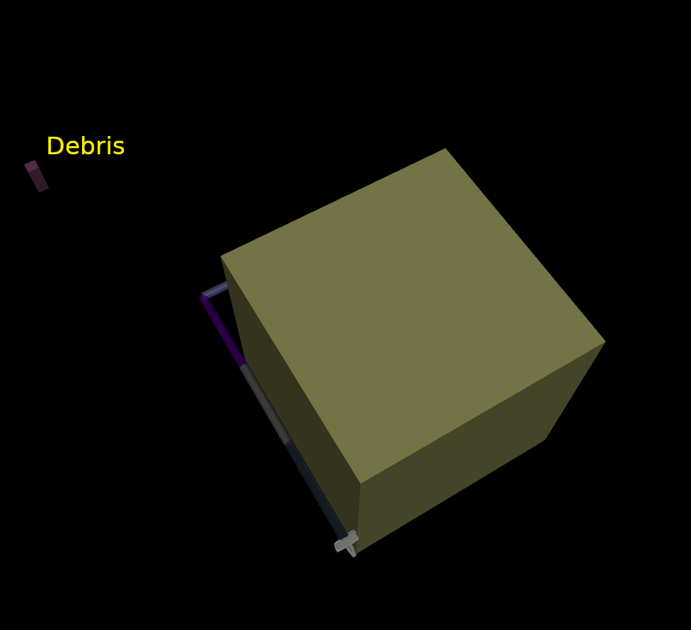

## Installation

1. Clone the repository and inside ``` spaceRobot_RL ``` folder (where the ```setup.py``` is), run

``` pip install -e . ```

## Test Installation

``` python
import gym
import spacecraftRobot
env = gym.make('SpaceRobot-v0')
```





